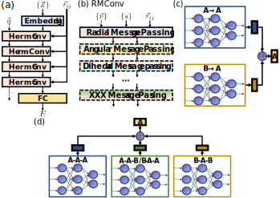
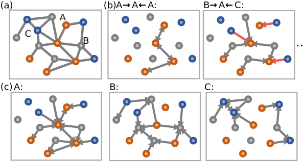
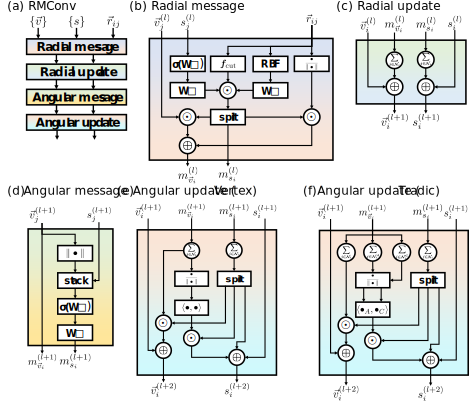

# HermNet
Heterogeneous relational message passing networks (```HermNet```)
```
   __ __              _  __    __ 
  / // ___ ______ _  / |/ ___ / /_
 / _  / -_/ __/  ' \/    / -_/ __/
/_//_/\__/_/ /_/_/_/_/|_/\__/\__/ 
```


[](https://www.nature.com/articles/s41524-022-00739-1)


## Table of Contents

- [HermNet](#hermnet)
  - [Table of Contents](#table-of-contents)
  - [Architecture](#architecture)
  - [Requirements](#requirements)
  - [Citation](#citation)

## Architecture
Three kinds of HermNet are proposed, i.e. Heterogeneous Vertex Networks (HVNet), Heterogeneous Pair Networks (HPNet), Heterogeneous Triadic Networks (HTNet). `HermNet` is inspired by [`LAMMPS`](https://lammps.sandia.gov/), whose [`pair_style`](https://lammps.sandia.gov/doc/pairs.html) could be set as [`hybrid`](https://lammps.sandia.gov/doc/pair_hybrid.html), which is self-consistent with heterogeneous. The entire architecture of `HermNet` is displayed as follows,



The subgraphs are extracted with the following operations, 


The sub-network used in the manuscript is a modified and simplified [PAINN](https://arxiv.org/abs/2102.03150), which is shown as follows, 



## Requirements
The following libraries are required:
```
PyTorch
Numpy
DGL>=0.6.0
Scikit_Learn
Pymatgen
Ase
```
The code has been tested with the libraries whose versions could be found in [`requirements.txt`](./requirements.txt).

***Tips:***
* Install ```DGL``` with ```pip install --pre dgl``` (CPU version) or ```pip install --pre dgl-${CUDA}``` (GPU version).

## Citation
```
@article{wang2022heterogeneous,
  title={Heterogeneous relational message passing networks for molecular dynamics simulations},
  author={Wang, Zun and Wang, Chong and Zhao, Sibo and Xu, Yong and Hao, Shaogang and Hsieh, Chang Yu and Gu, Bing-Lin and Duan, Wenhui},
  journal={npj Computational Materials},
  volume={8},
  number={1},
  pages={1--9},
  year={2022},
  publisher={Nature Publishing Group}
}
```